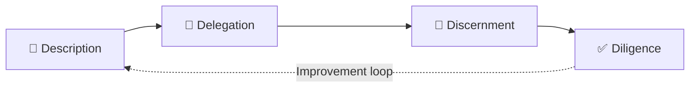

#  Beyond Basic Prompting
### Mastering AI in 2026

*A guide to moving beyond basic search and into strategic, AI-augmented co-creation*

---

##  Table of Contents

- [Introduction](#-introduction)
- [Daily Toolkit](#️-daily-toolkit)
- [The Secret Framework: The 4D Method](#-the-secret-framework-the-4d-method)
- [Breaking Down the 4 Pillars](#-breaking-down-the-4-pillars)
- [How to Contribute](#-how-to-contribute)

---

## Introduction

In 2026, **everyone uses AI**, but **95% of users** still limit themselves to basic searches or shallow prompting. They're missing out on the real power of current models.

This repository is an introduction to **the art of AI-augmented co-creation and strategy** — an approach built for professionals who want to turn AI into a true production lever, not just a smarter search engine.

>  *"AI doesn't replace thinking — it amplifies it, as long as you know how to steer it."*

---

##  Daily Toolkit

Our workflow relies on the complementary strengths of the two market leaders, combining raw computational power with reasoning depth:

| Tool | Primary Role | Link |
|:---:|:---|:---:|
|  | Fast generation, brainstorming, broad exploration | [chatgpt.com](https://chatgpt.com/) |
|  | Deep reasoning, structured writing, analytical rigor | [claude.ai](https://claude.ai/) |

---

## The Secret Framework: The 4D Method

To achieve elite results that are hard for anyone else to replicate, we apply a strict methodology built on **four fundamental pillars**.

---

##  Breaking Down the 4 Pillars

### 1️⃣ Description
> Formulate a clear, precise, and well-contextualized intent.

- Define the end goal before writing the prompt
- Provide business/domain context (networking, cybersecurity, AI...)
- Specify the expected output format

### 2️⃣ Delegation
> Hand off the task to the right model, with the right level of autonomy.

- Split tasks between ChatGPT and Claude based on their respective strengths
- Let the AI propose an initial structure
- Avoid over-micromanaging the prompt

### 3️⃣ Discernment
> Analyze the response with a critical, expert eye.

- Check technical consistency (especially in cybersecurity/networking)
- Spot biases, approximations, or hallucinations
- Cross-check the response against reliable sources

### 4️⃣ Diligence
> Refine, correct, and industrialize the final output.

- Iterate until reaching a professional-quality deliverable
- Document the process for reuse
- Publish/share with real added value

---

##  How to Contribute

###  Welcome!

Glad you're here. Feel free to explore, open an issue, or submit a pull request — every contribution is appreciated.

 Got a question, a suggestion, or just want to connect? Feel free to reach out directly:

---

*Built with 🧠 and rigor — 2026*

